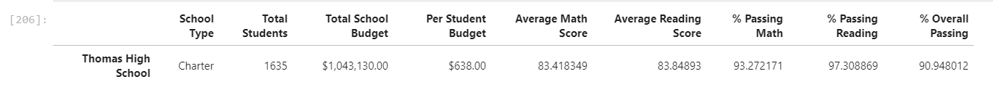
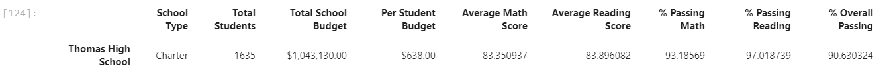
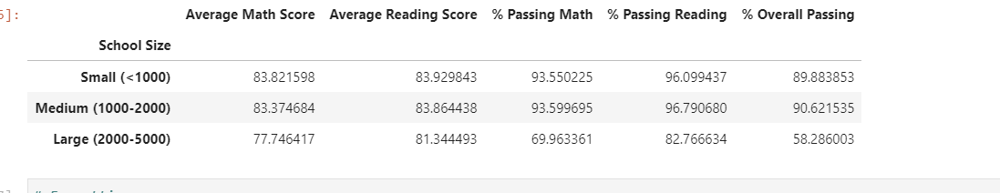
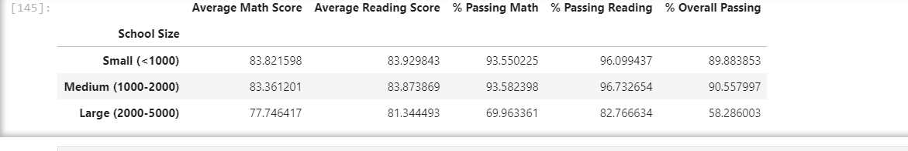

# School_District_Analysis

## Overview

Due to academic dishonesty from 9th grader's reading and math scores at Thomas High School, we have been tasked with replacing those scores with value of NaN. To keep the data intact we have repeated the same process of before during the module.

## Results

### How is the district summary affected?
- Below is the original summary
  - 
- Below is the modified summary
  - 
  
- The district summary was only minorly affected, the average math score, % passing math and reading decreased, and %overall passing decreased by only .1%.

### How is the school summary affected?
- As seen in the below pictures first the original summary and second the modified summary all the scores were decreased by about less then .1% , one suprise was the average reading score increased. 
- 
- 

### How does replacing the ninth-grade scores affect the following?
- Math and reading scores by grade
  - These scores all dropped due to the fact that they were values replaced by Nan.
- Scores by school size:
  - As seen below the since Thomas High School was a medium size school all the scores decreased by at least .01%. The biggest decrease were the Overall.
  - original below:
  - 
  -Modified below:
  - 
- Scores by school spending:
  - Without formatting the scores by 1 decimal place, then we can see that difference in scores, it is minimal difference. It is about a .01% difference.
- Scores by type :
  - As mentioned before, without the formatting then we can see the difference in scores. In this case since Thomas High School was of type "Charter" then that is where the difference.
  
  
  
